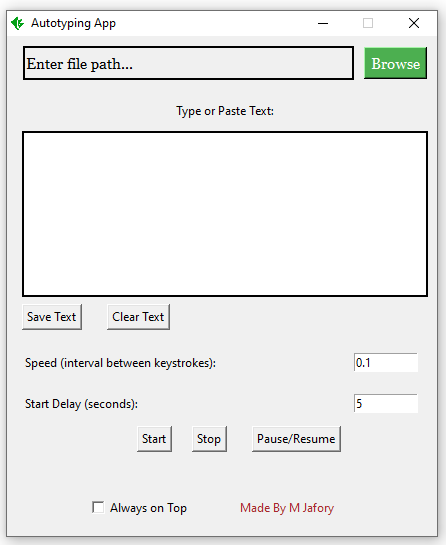

# Autotyping App

The Autotyping App is a simple Python application built using Tkinter and PyAutoGUI. It allows users to automate the process of typing text from a file into an input field with customizable speed and delay settings.

## Features

- **File Selection:** Choose a text file (.txt), Word document (.docx), or PDF (.pdf) to extract text content.
- **Speed Control:** Adjust the typing speed with customizable intervals between keystrokes.
- **Delay Control:** Set a start delay to allow users to switch to the desired input field before autotyping begins.
- **Start, Stop, and Pause/Resume Buttons:** Control the autotyping process with these intuitive buttons.
- **Always on Top:** Toggle the application window to stay on top of other windows.

## Usage

1. Run the application and select a file using the "Browse" button.
2. Adjust speed and delay settings as needed.
3. Click "Start Autotype" to begin the autotyping process after a specified delay.
4. Use "Pause/Resume" to temporarily halt or restart autotyping.
5. Click "Stop Autotype" to terminate the autotyping process.

## Requirements

- Python 3.x
- Tkinter
- PyAutoGUI
- docx (python-docx)
- PyMuPDF (fitz)

## How to Run

1. Install the required dependencies: `pip install tk pyautogui python-docx PyMuPDF`
2. Run the script: `python autotyping_app.py`

## Download
- [Executable (.exe)](link_to_autotyping_app.exe)
- [Source Code](link_to_repository)